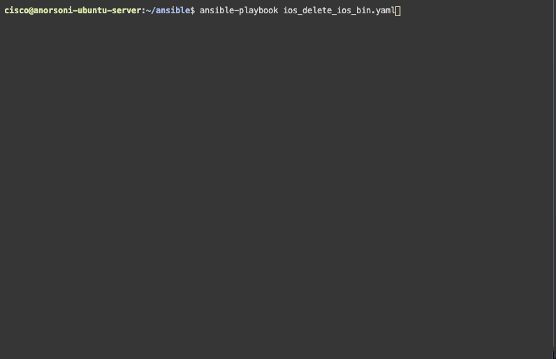

# ansible-download-os
Download a new OS from TFTP server using Ansible.

# Setup
Don't forget to install sshpass to use ssh connections with passwords.

```
apt-get install sshpass
```

# Demo
## Downloading the IOS


## Deleting the IOS


